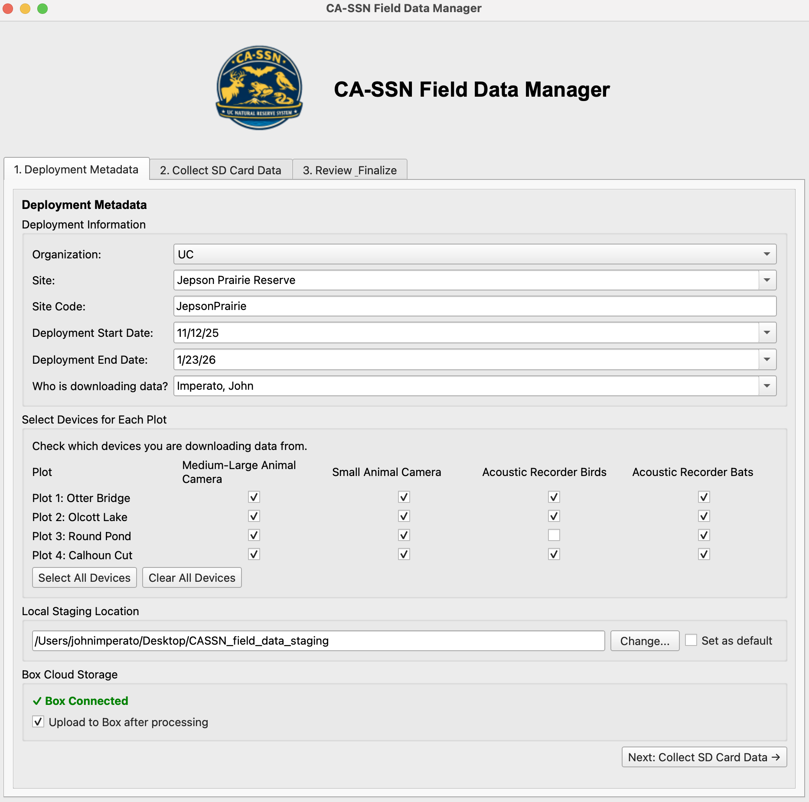

# CA-SSN Field Data Manager

A Python desktop application for streamlined wildlife monitoring data collection and management. Designed for the University of California Natural Reserve System (UCNRS) California Sentinel Sites for Nature (CASSN) team working with camera traps and acoustic recorders across California.


## Features

- **Guided Workflow**: Step-by-step interface for multi-plot, multi-device data collection
- **Automatic File Renaming**: Standardized naming convention: `ORG_SITE_plotN_DEVTYPE_YYYYMM_SEQNO.ext`
- **Metadata Extraction**: Automatic EXIF data extraction from images
- **Data Integrity**: SHA-256 file hashing for verification
- **Cloud Storage**: Automatic upload to Box with progress tracking and OAuth token refresh
- **File Support**: Images (JPG, PNG, TIF, RAW), audio (WAV, MP3, FLAC)
- **Comprehensive Logging**: CSV and JSON metadata files with deployment manifest
- **Reserve-Specific Configuration**: Pre-configured for 40+ UCNRS reserves with plot-specific naming

## Screenshots

### Deployment Metadata Entry
Enter deployment information, select devices, and configure storage location.



### SD Card Data Collection
Copy files from SD cards with automatic renaming and metadata extraction.

### Review & Finalize
View deployment summary and upload to Box cloud storage.

## Installation

### Prerequisites

- Python 3.8 or higher
- pip package manager

### Install Dependencies

```bash
pip install PySide6 pillow piexif box-sdk-gen
```

### Download

Clone this repository or download the latest release:

```bash
git clone https://github.com/john-imperato/cassn-field-data-manager.git
cd cassn-field-data-manager
```

### Configure Box Credentials

Create your configuration file from the template:

```bash
cp config.json.example config.json
```

Edit `config.json` and add your Box application credentials:

```json
{
  "box": {
    "client_id": "YOUR_BOX_CLIENT_ID",
    "client_secret": "YOUR_BOX_CLIENT_SECRET",
    "target_folder_id": "YOUR_BOX_FOLDER_ID"
  }
}
```

**To get Box credentials:**
1. Go to https://app.box.com/developers/console
2. Create a new app (Custom App → OAuth 2.0)
3. Copy the Client ID and Client Secret
4. Find your target folder ID from the Box web interface URL

## Usage

### 1. Box Authentication (First Time Setup)

After configuring `config.json`, authenticate with Box:

```bash
python box_auth_setup.py
```

Follow the prompts to:
- Open the Box authorization URL in your browser
- Grant access to the application
- Copy the authorization code back to the terminal

This creates a `box_tokens.json` file that enables automatic cloud uploads.

### 2. Run the Application

```bash
python cassn_field_data_manager.py
```

### 3. Workflow

#### Step 1: Deployment Metadata
- Select your organization (UC, CSU, CDFW, Pepperwood)
- Choose the reserve/site from dropdown (auto-complete enabled)
- Enter deployment start and end dates
- Select who is downloading the data
- Check which devices (ML, SA, BD, BT) for each plot
- Configure local staging location (default: `~/Desktop/CASSN_field_data_staging`)
- Enable/disable automatic Box upload

#### Step 2: Collect SD Card Data
- Insert SD card for each device
- Select the device from the list
- Click "Select SD Card & Copy Files"
- Files are automatically:
  - Copied to local staging
  - Renamed with standardized naming
  - Processed for EXIF metadata
  - Hashed for integrity verification
- Repeat for all devices

#### Step 3: Review & Finalize
- Review deployment summary
- View file counts and sizes by device
- Files automatically upload to Box (if enabled)
- Open staging folder to verify
- Start new deployment or exit

## Output Structure

The application creates an organized folder structure in your staging location:

```
ORG_SITE_YYYYMMDD/
├── deployment_metadata.json    # Deployment configuration
├── manifest.json                # File count and device summary
├── file_metadata.csv            # Detailed file metadata
└── raw_data/
    ├── p1_ML/                   # Plot 1, Medium-Large camera
    │   ├── UC_Bodega_plot1_ML_202601_00001.jpg
    │   ├── UC_Bodega_plot1_ML_202601_00002.jpg
    │   └── ...
    ├── p1_BD/                   # Plot 1, Bird recorder
    │   ├── UC_Bodega_plot1_BD_202601_00001.wav
    │   └── ...
    └── ...
```

### Metadata CSV Fields

The `file_metadata.csv` includes:
- Original and new filenames
- Plot number and label
- Device type and label
- File type (image/audio/video)
- File size and SHA-256 hash
- Timestamp
- GPS coordinates (if available)
- EXIF data (DateTime, Make, Model)
- Source path

## Supported Organizations & Reserves

### Organizations
- UC (University of California)
- CSU (California State University)
- CDFW (California Department of Fish and Wildlife)
- Pepperwood Preserve

### Device Types
- **ML**: Medium-Large Animal Camera
- **SA**: Small Animal Camera
- **BD**: Acoustic Recorder (Birds)
- **BT**: Acoustic Recorder (Bats)

### Pre-configured Reserves

The application includes 40+ UCNRS reserves with automatic site code mapping:
- Angelo Coast Range Reserve
- Año Nuevo Island Reserve
- Blue Oak Ranch Reserve
- Bodega Marine Reserve
- Hastings Natural History Reservation
- Sedgwick Reserve
- And many more...

Some reserves have custom plot names (e.g., QuailRidge: PleasureCove, DeckerCanyon, ChaparralRidge, FarPond).

## Configuration

### Persistent Settings

The application saves your preferred staging location:

```
~/.cassn_wizard/config.json
```

Check "Set as default" in the metadata tab to save your staging location preference.

### Box Configuration

Box credentials and folder IDs are configured in `config.json`:
- `client_id`: Your Box application Client ID
- `client_secret`: Your Box application Client Secret
- `target_folder_id`: The Box folder ID where data will be uploaded
- Tokens are automatically stored in: `box_tokens.json`

**Important:** Never commit `config.json` to version control. It contains sensitive credentials.

### Lookup Tables

The application loads site and plot information from CSV files in the `data/` folder:

**data/sites.csv**
- Maps site names to site codes and label codes
- Contains 41 UCNRS reserves
- Format: `site_name,site_code,label_code`
- Example: `Bodega Marine Reserve,Bodega,BOD`
- **Edit this file to add new reserves** - changes take effect on next app launch

**data/plots.csv**
- Contains custom plot names for specific reserves
- Format: `site_code,plot_number,plot_name`
- Reserves with named plots:
  - Angelo: Wilderness Lodge Meadow, South Fork Eel River, Oak Woodland, Elder Creek
  - Bodega: Native Dunes, Lab Pond, Coastal Prairie, Gaffney Point
  - Jepson: BarkerSlough-OtterBridge, OlcottLake, RoundPond, CalhounCut
  - QuailRidge: Far Pond, ChaparralRidge, Pleasure Cove, Decker Canyon
  - Sedgwick: Waterfall, Bone Canyon, Windmill, Vernal Pool
- **Edit this file to customize plot names** - changes take effect on next app launch
- Leave `plot_name` empty for plots without custom names

## Troubleshooting

### Box Upload Fails

**Problem**: Upload to Box fails with authentication error

**Solution**:
1. Delete `box_tokens.json`
2. Re-run `python box_auth_setup.py`
3. Restart the application

### EXIF Data Not Extracted

**Problem**: No GPS coordinates or camera info in metadata

**Solution**:
1. Ensure PIL and piexif are installed: `pip install pillow piexif`
2. Check that images contain EXIF data (some cameras don't embed GPS)
3. RAW formats may require camera-specific libraries

### Files Not Copying

**Problem**: SD card files not copying or "Permission denied" error

**Solution**:
- Ensure SD card is mounted and accessible
- Check file permissions on SD card
- Try copying a few files manually to verify SD card is readable
- On macOS, grant Terminal/Python "Full Disk Access" in System Preferences > Privacy

### Application Won't Start

**Problem**: Error on launch or missing dependencies

**Solution**:
```bash
# Reinstall all dependencies
pip install --upgrade PySide6 pillow piexif box-sdk-gen

# Check Python version (must be 3.8+)
python --version
```

## Development

### Project Structure

```
cassn-field-data-manager/
├── cassn_field_data_manager.py       # Main application
├── box_auth_setup.py                 # Box OAuth authentication
├── assets/                           # Visual assets (logos for app UI)
│   ├── ucnrs_logo.png                # UCNRS logo (optional)
│   └── cassn_icon.png                # CA-SSN logo (optional)
├── data/                             # Lookup tables and reference data
│   ├── sites.csv                     # Site/reserve lookup table
│   └── plots.csv                     # Plot names lookup table
├── screenshots/                      # Application screenshots for README
├── .gitignore                        # Git ignore file
└── README.md                         # This file
```

### Version History

**Version 2.1** (Current)
- OAuth automatic token refresh
- Dual logo branding (CA-SSN + UCNRS)
- Box upload progress tracking
- Improved UI organization
- Cloud backup with automatic token management

**Version 2.0**
- Initial PySide6 implementation
- Local staging and metadata generation
- EXIF extraction
- Multi-plot, multi-device workflow

### Adding New Reserves

To add a new reserve, edit `data/sites.csv`:

```csv
New Reserve Name,NewCode,NRC
```

Format: `site_name,site_code,label_code`

To add custom plot names for a reserve, edit `data/plots.csv`:

```csv
NewCode,1,North Plot
NewCode,2,South Plot
NewCode,3,East Plot
NewCode,4,West Plot
```

Format: `site_code,plot_number,plot_name`

Leave the `plot_name` field empty for plots without custom names. Restart the application to see changes.

## Contributing

Contributions are welcome! Please follow these guidelines:

1. Fork the repository
2. Create a feature branch (`git checkout -b feature/amazing-feature`)
3. Commit your changes (`git commit -m 'Add amazing feature'`)
4. Push to the branch (`git push origin feature/amazing-feature`)
5. Open a Pull Request

### Areas for Contribution

- Additional cloud storage providers (Google Drive, AWS S3, Azure)
- Wildlife Insights direct upload integration
- Database backend for metadata storage
- Bulk deployment management
- Audio file metadata extraction
- Video thumbnail generation
- Progress bars for large file copies
- Unit tests and CI/CD

## License

This project is licensed under the MIT License - see the LICENSE file for details.

## Authors

- **John Imperato** - Initial development
- CA-SSN Field Team - Requirements and testing

## Acknowledgments

- University of California Natural Reserve System (UCNRS)
- California Department of Fish and Wildlife (CDFW)
- California Statewide Surveillance Network (CA-SSN)
- Wildlife Insights for metadata standards inspiration

## Support

For questions or issues:
- Open an issue on GitHub
- Contact the CA-SSN data management team
- Email: [your-email@example.com]

## Citation

If you use this software in your research, please cite:

```
Imperato, J. (2025). CA-SSN Field Data Manager: A tool for wildlife monitoring
data collection and management. GitHub repository.
https://github.com/yourusername/cassn-field-data-manager
```

---

**Note**: This application was developed for the California Statewide Surveillance Network to streamline field data collection workflows across California's natural reserves. It is designed to work with standardized monitoring protocols for camera traps and acoustic recorders.
