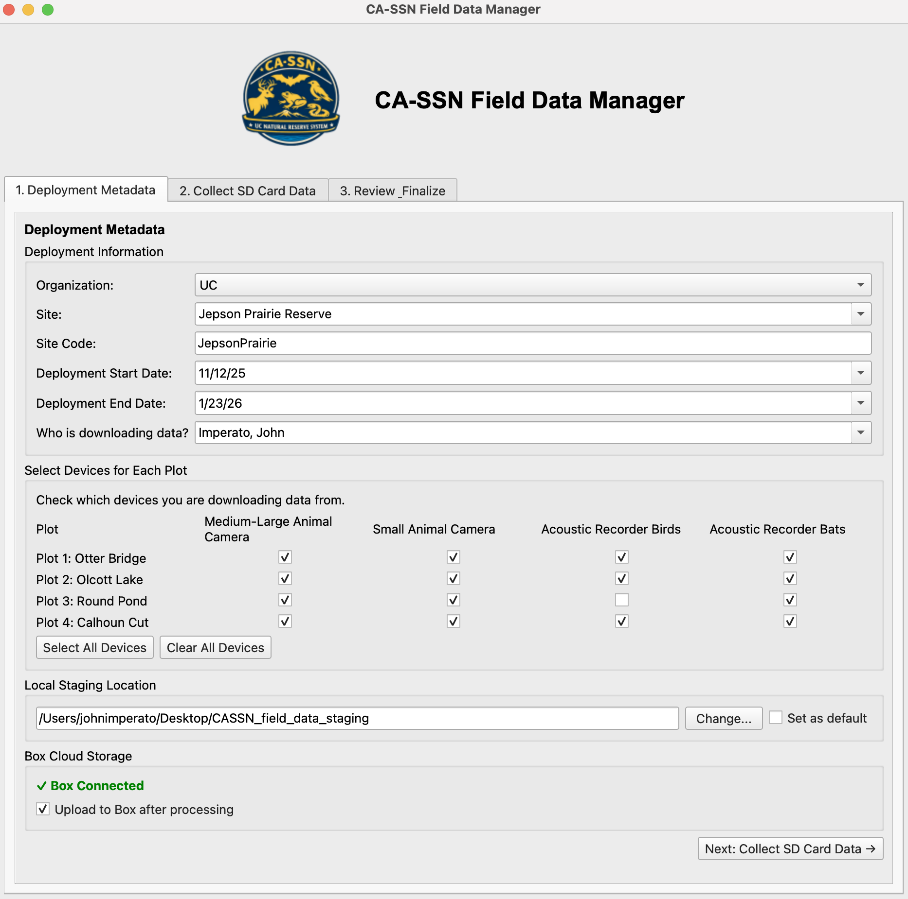
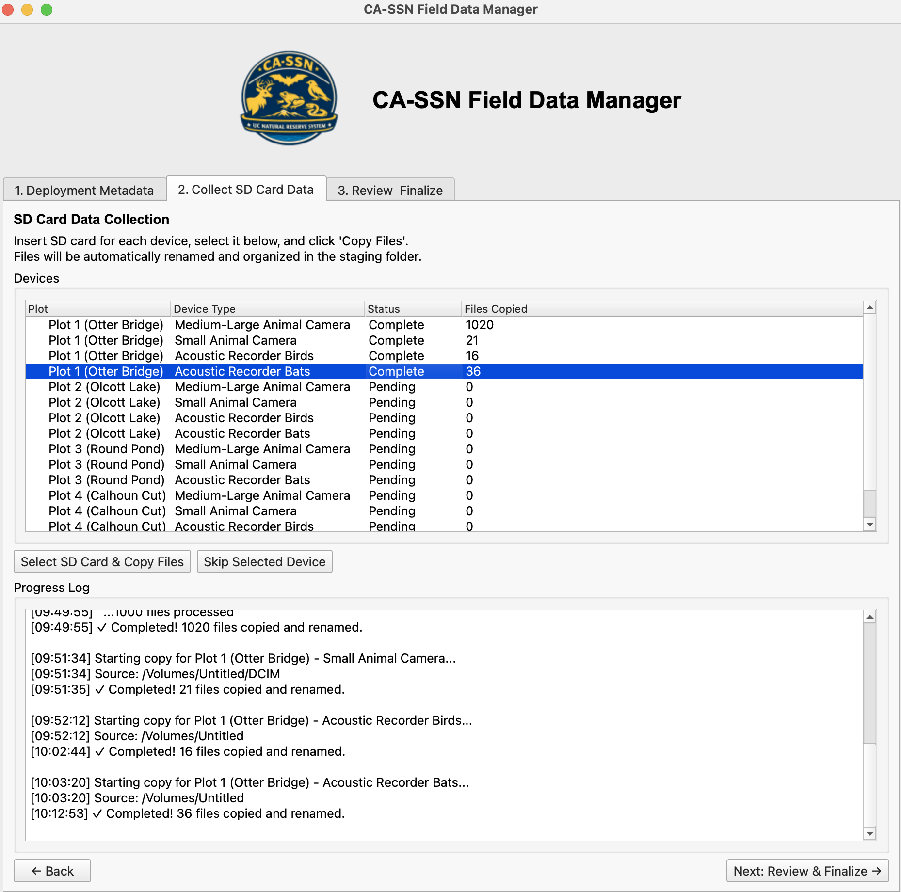
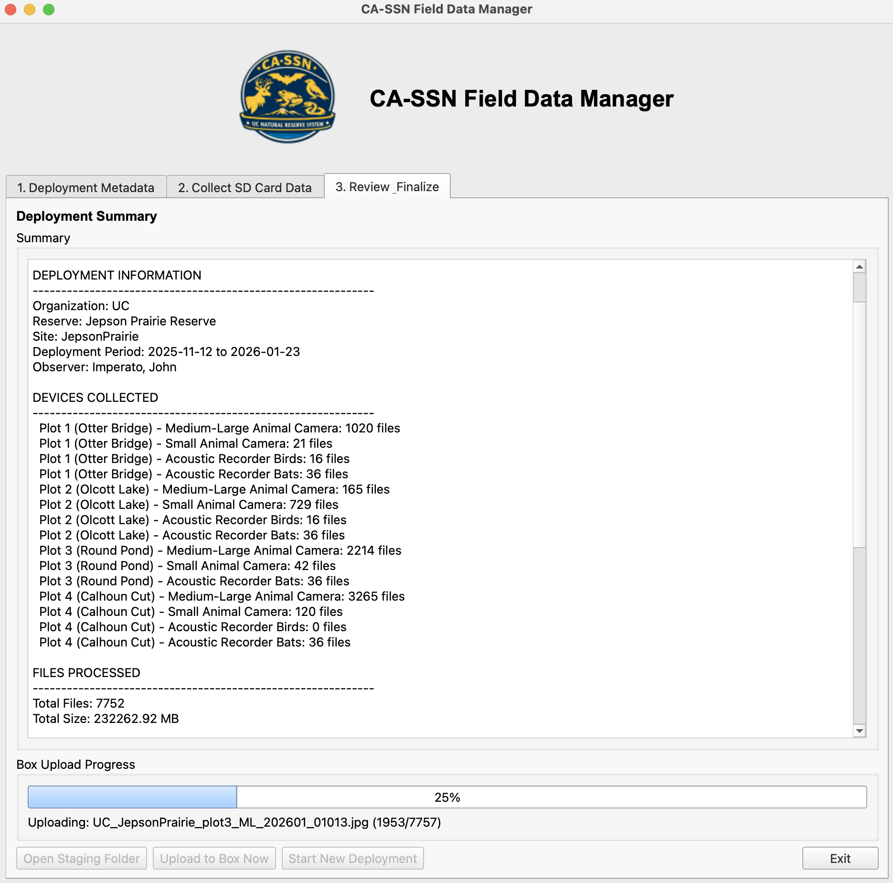

# CA-SSN Field Data Manager

A Python desktop application for streamlined wildlife monitoring data collection and management. Designed for the University of California Natural Reserve System (UCNRS) California Sentinel Sites for Nature (CASSN) team working with camera traps and acoustic recorders across California.


## Features

- **Guided Workflow**: Step-by-step interface for multi-plot, multi-device data collection
- **Automatic File Renaming**: Standardized naming convention: `ORG_SITE_plotN_DEVTYPE_YYYYMM_SEQNO.ext`
- **Metadata Extraction**: Automatic EXIF data extraction from images
- **Data Integrity**: SHA-256 file hashing for verification
- **Cloud Storage**: Automatic upload to Box with progress tracking and OAuth token refresh
- **File Support**: Images (JPG, PNG, TIF, RAW), audio (WAV, MP3, FLAC)
- **Comprehensive Logging**: CSV and JSON metadata files with deployment manifest
- **Reserve-Specific Configuration**: Pre-configured for 40+ UCNRS reserves with plot-specific naming

## Screenshots

### Deployment Metadata Entry
Enter deployment information, select devices, and configure storage location.



### SD Card Data Collection
Copy files from SD cards with automatic renaming and metadata extraction.



### Review & Upload to Box
View deployment summary and upload to Box cloud storage.



## Installation

### Prerequisites

- Python 3.8 or higher
- pip package manager

### Install Dependencies

```bash
pip install PySide6 pillow piexif box-sdk-gen
```

### Download

Clone this repository or download the latest release:

```bash
git clone https://github.com/john-imperato/cassn-field-data-manager.git
cd cassn-field-data-manager
```

### Configure Box Credentials

Credentials are stored in `~/.cassn_credentials/` — a hidden folder in your home directory, outside the repo so they are never accidentally committed to version control.

Create the folder and config file:

```bash
mkdir -p ~/.cassn_credentials
cp config.json.example ~/.cassn_credentials/config.json
```

Edit `~/.cassn_credentials/config.json` and add your Box application credentials:

```json
{
  "box": {
    "client_id": "YOUR_BOX_CLIENT_ID",
    "client_secret": "YOUR_BOX_CLIENT_SECRET",
    "target_folder_id": "YOUR_BOX_FOLDER_ID"
  }
}
```

Lock down the folder permissions so only you can read it:

```bash
chmod 700 ~/.cassn_credentials
chmod 600 ~/.cassn_credentials/config.json
```

**To get Box credentials:**
1. Go to https://app.box.com/developers/console
2. Create a new app (Custom App → OAuth 2.0)
3. Copy the Client ID and Client Secret
4. Find your target folder ID from the Box web interface URL

## Usage

### 1. Box Authentication (First Time Setup)

After configuring `~/.cassn_credentials/config.json`, authenticate with Box
using the utility script:

```bash
python3 utils/box_auth_setup.py
```

Follow the prompts to:
- Open the Box authorization URL in your browser
- Grant access to the application
- Paste the full redirect URL back into the terminal

This creates or refreshes `~/.cassn_credentials/box_tokens.json`, which enables automatic cloud uploads. No manual copy step is required. For detailed Box utility documentation, see [`utils/README.md`](utils/README.md). Box tokens expire after ~60 days — re-run the command above to refresh them.

### 2. Run the Application

```bash
python cassn_field_data_manager.py
```

### 3. Workflow

#### Step 1: Deployment Metadata
- Select UC as the organization
- Choose the reserve/site from dropdown (auto-complete enabled)
- Enter deployment start and end dates
- Select who is downloading the data
- Check which devices (ML, SA, BD, BT) for each plot
- Configure local staging location (default: `~/Desktop/CASSN_field_data_staging`)
- Enable/disable automatic Box upload

#### Step 2: Collect SD Card Data
- Insert SD card for each device
- Select the device from the list
- Click "Select SD Card & Copy Files"
- Files are automatically:
  - Copied to local staging
  - Renamed with standardized naming
  - Processed for EXIF metadata
  - Hashed for integrity verification
- Repeat for all devices

#### Step 3: Review & Finalize
- Review deployment summary
- View file counts and sizes by device
- Files automatically upload to Box (if enabled)
- Open staging folder to verify
- Start new deployment or exit

## Output Structure

The application creates an organized folder structure in your staging location:

```
ORG_SITE_YYYYMMDD/
├── deployment_metadata.json    # Deployment configuration
├── manifest.json                # File count and device summary
├── file_metadata.csv            # Detailed file metadata
└── raw_data/
    ├── p1_ML/                   # Plot 1, Medium-Large camera
    │   ├── UC_Bodega_plot1_ML_202601_00001.jpg
    │   ├── UC_Bodega_plot1_ML_202601_00002.jpg
    │   └── ...
    ├── p1_BD/                   # Plot 1, Bird recorder
    │   ├── UC_Bodega_plot1_BD_202601_00001.wav
    │   └── ...
    └── ...
```

### Metadata CSV Fields

The `file_metadata.csv` includes:
- Original and new filenames
- Plot number and label
- Device type and label
- File type (image/audio)
- File size and SHA-256 hash
- Timestamp
- EXIF data (DateTime, Make, Model)
- Source path

## Device Types

- **ML**: Medium-Large Animal Camera
- **SA**: Small Animal Camera
- **BD**: Acoustic Recorder (Birds)
- **BT**: Acoustic Recorder (Bats)

## Configuration

### Persistent Settings

The application saves your preferred staging location and Box credentials in:

```
~/.cassn_credentials/config.json
~/.cassn_credentials/box_tokens.json
```

This folder is outside the git repo and never committed to version control.

### Box Configuration

Box credentials and folder IDs are stored in `~/.cassn_credentials/config.json`:
- `client_id`: Your Box application Client ID
- `client_secret`: Your Box application Client Secret
- `target_folder_id`: The Box folder ID where data will be uploaded
- Tokens are automatically stored in: `~/.cassn_credentials/box_tokens.json`

### Lookup Tables

The application loads site and plot information from CSV files in the `data/` folder:

**data/sites.csv**
- Maps site names to site codes and label codes
- Contains 41 UCNRS reserves
- Format: `site_name,site_code,label_code`
- Example: `Bodega Marine Reserve,Bodega,BOD`
- **Edit this file to add new reserves** - changes take effect on next app launch

**data/plots.csv**
- Contains custom plot names for specific reserves
- Format: `site_code,plot_number,plot_name`
- **Edit this file to customize plot names** - changes take effect on next app launch

## Building the macOS App

To run as a double-clickable macOS `.app` (no terminal required):

```bash
bash build.sh
```

This will:
1. Install PyInstaller if needed
2. Convert the icon to macOS format
3. Bundle Python, all dependencies, assets, and data into a self-contained `.app`
4. Output `dist/CASSN Field Data Manager.app`

Then install it:

```bash
sudo rm -rf "/Applications/CASSN Field Data Manager.app"
cp -r "dist/CASSN Field Data Manager.app" /Applications/
```

**Note:** `~/.cassn_credentials/config.json` and `~/.cassn_credentials/box_tokens.json` must be set up before launching the `.app`. The bundle does not include credentials.

To rebuild after code changes, run `bash build.sh` again and reinstall.

## Development

### Project Structure

```
cassn-field-data-manager/
├── cassn_field_data_manager.py       # Main application
├── box_auth_setup.py                 # Box OAuth authentication
├── build.sh                          # Script to build the macOS .app bundle
├── cassn_field_data_manager.spec     # PyInstaller configuration for the .app build
├── config.json.example               # Configuration template
├── assets/                           # Visual assets (logos for app UI)
│   ├── ucnrs_logo.png                # UCNRS logo
│   ├── cassn_icon.png                # CA-SSN logo
│   └── cassn_icon.icns               # macOS icon format (generated by build.sh)
├── data/                             # Lookup tables and reference data
│   ├── sites.csv                     # Site/reserve lookup table
│   └── plots.csv                     # Plot names lookup table
├── screenshots/                      # Application screenshots for README
├── .gitignore                        # Git ignore file
└── README.md                         # This file
```
