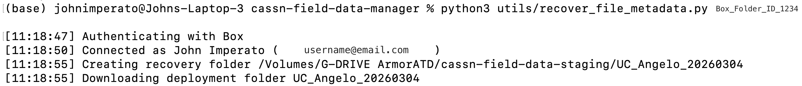

# CA-SSN Field Data Manager — Utilities

Helper scripts for maintenance and data recovery tasks.

---

## `recover_file_metadata.py`

Recovers a deployment by downloading the full Box folder to the staging drive,
then regenerating:

- `file_metadata.csv`
- `manifest.json`
- `recovery_report.json`

### When to use

If the app completed SD card processing and Box upload successfully but
the deployment metadata artifacts were not written locally or need to be rebuilt.

### Requirements
```bash
pip install Pillow box-sdk-gen
```

Pillow is required. The script fails immediately if EXIF support is unavailable.

### Setup

1. Confirm Box credentials exist in `~/.cassn_credentials/`:
   - `config.json`
   - `box_tokens.json`
2. Confirm the recovery drive path exists:
   - `/Volumes/G-DRIVE ArmorATD/cassn-field-data-staging`
3. Find the Box deployment folder ID from the Box URL:
   - `https://app.box.com/folder/123456789012`

### Run
```bash
python3 utils/recover_file_metadata.py BOX_FOLDER_ID
```

Replace `BOX_FOLDER_ID` with the numeric deployment folder ID from Box. Do not include angle brackets.

The script recovers exactly one deployment folder per run.

Progress is printed to the terminal as files are downloaded and processed.

Example terminal output during a live recovery run:



### Output

The script creates a local recovery folder under:

```text
/Volumes/G-DRIVE ArmorATD/cassn-field-data-staging/<deployment-folder-name>/
```

That folder contains:

- the downloaded Box deployment contents
- `file_metadata.csv`
- `manifest.json`
- `recovery_report.json`

If the deployment folder already exists locally, the script fails and does not overwrite it.

### Notes

- Authenticates using `~/.cassn_credentials/box_tokens.json` — no
  separate authentication step needed
- Downloads the entire deployment and preserves the Box folder structure
- Uses Box modified time for the recovered `timestamp` field
- Sets unrecoverable fields such as `original_filename` and `source_path` to `NA`
- Does not upload any recovered files back to Box
- Writes `recovery_report.json` even when the run completes with failures
